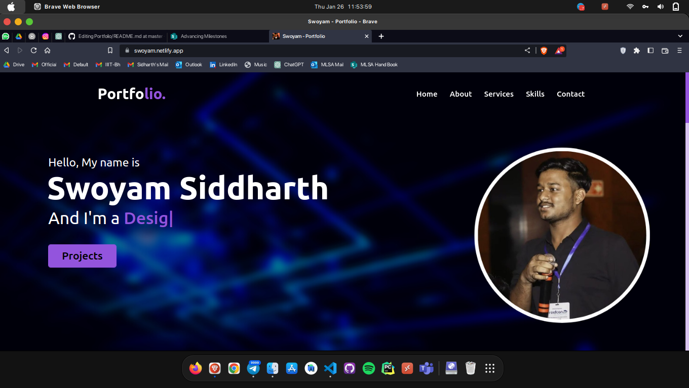
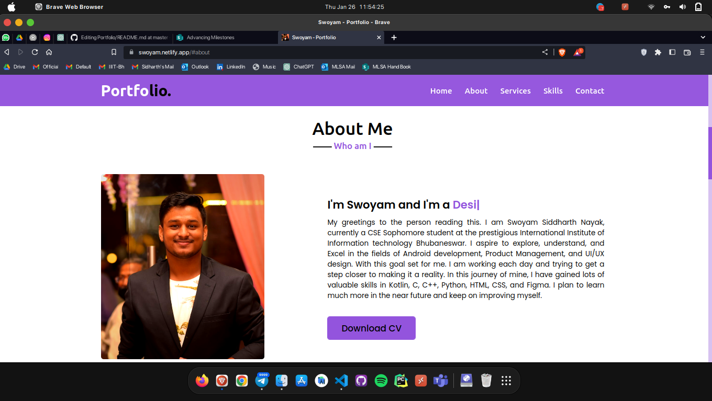
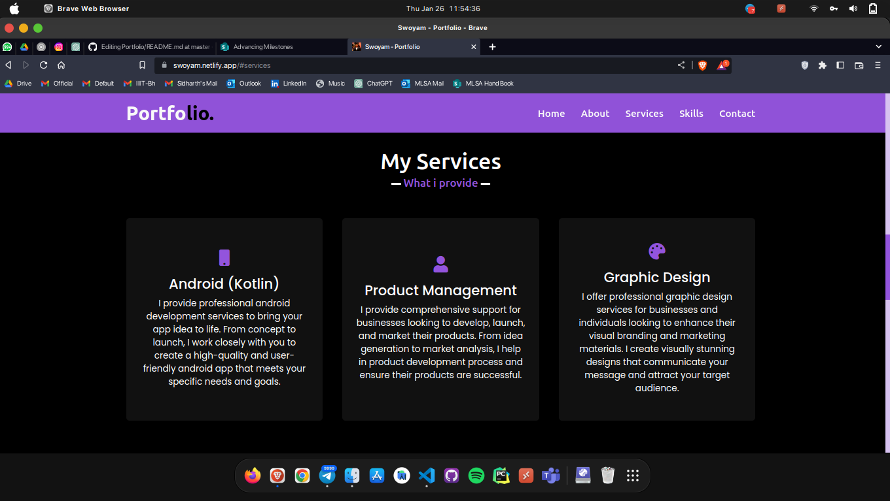
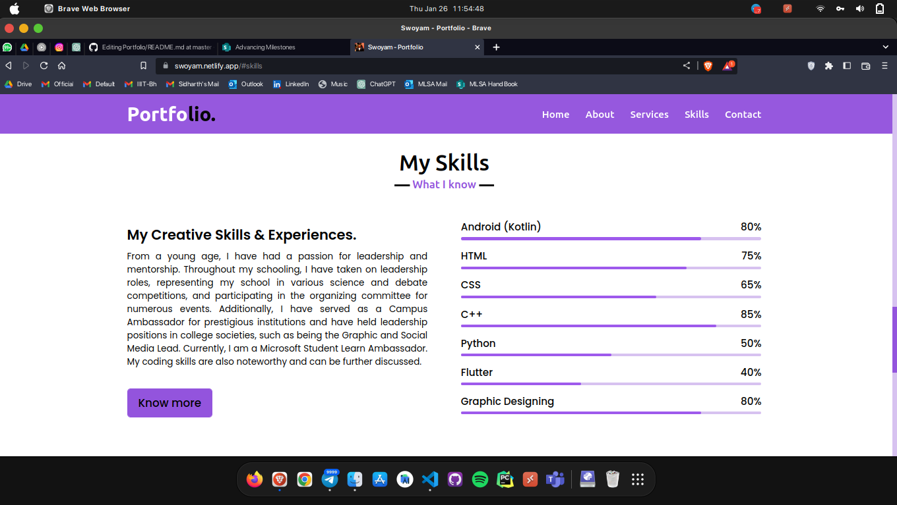
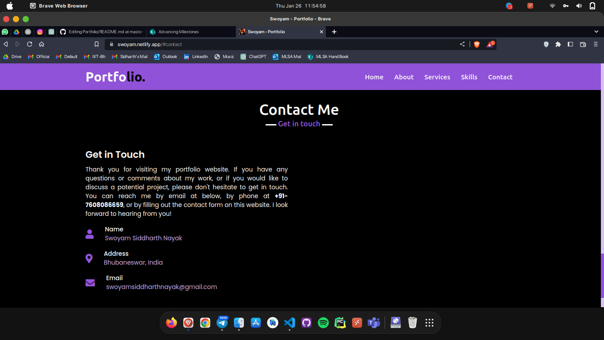

<h1>Portfolio Site</h1>

This repository contains the code for my personal portfolio site. The site showcases my professional experience, skills, and projects.

<h2>Tech Stack</h2>
<ol><li>HTML</li><li>CSS</li><li>JavaScript</li></ol>
<h2>Screenshots</h2>

 

 

 

 

<h2>Features</h2>
<ul><li>Responsive design for optimal viewing on all devices</li><li>Interactive elements such as hover effects and scrolling animations</li><li>Integration of external libraries such as Font Awesome and animate.css</li></ul>
<h2>Future Improvements</h2>
<ul><li>Add a contact form for easy communication</li><li>Implement a blog section to regularly post updates and thoughts</li></ul>
<h2>How to Use</h2>
<ol><li>Clone or download the repository</li><li>Open the index.html file in a web browser</li><li>Explore and enjoy!</li></ol>

Please feel free to use any portion of the code for your own personal or commercial projects. However, please give credit where credit is due and do not claim the work as your own.

